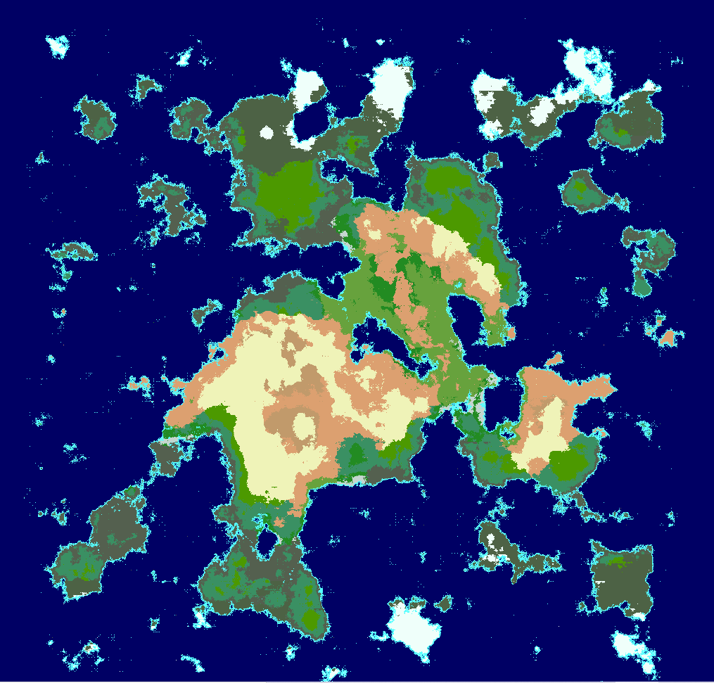
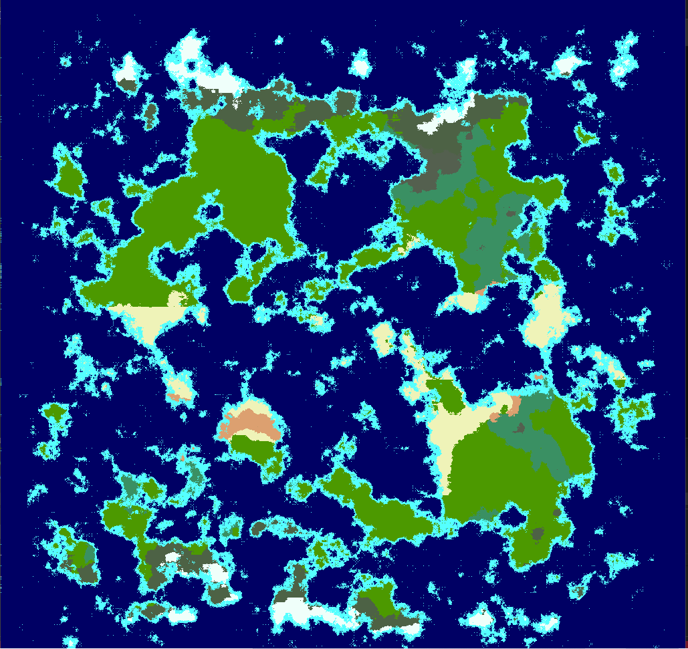
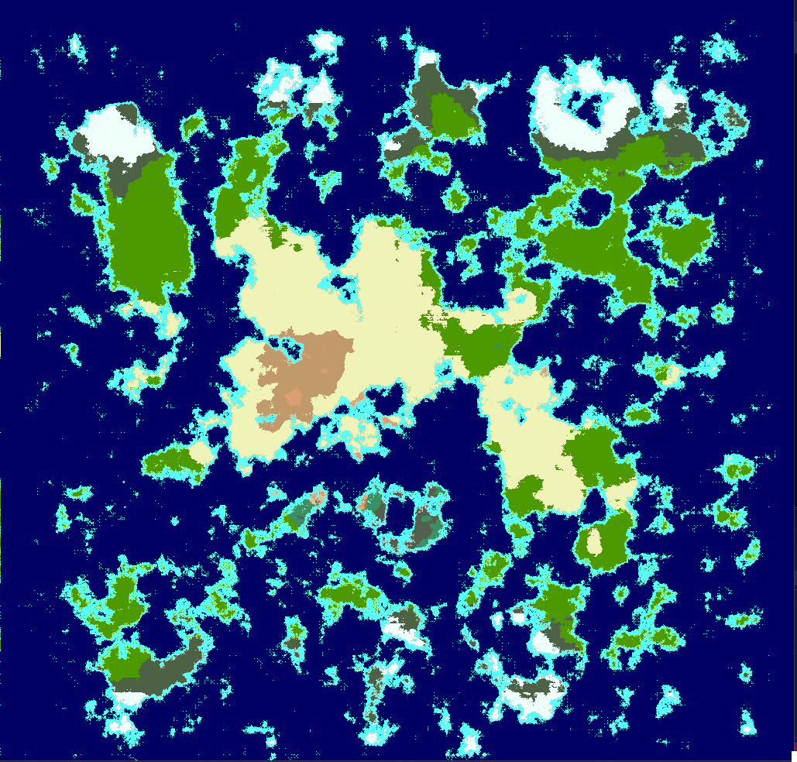

# Map generator
Simple generator for static squared maps. Generation include heigth, temperature and wet tileData.and form bioms based of that information.
Support drawing image of each element of tileData.
Main generation algorithm - [diamond-square](https://en.wikipedia.org/wiki/Diamond-square_algorithm ).       




# Example
 add this lines to your ofApp.cpp file to run standart generation 
```cpp
 #include "map/Map.h"
 syrenmap::Map globalMap(24);

void ofApp::setup() {
	globalMap.generate();
	globalMap.updateColoring();

}
 void ofApp::draw(){
	  ofBackground(255, 255, 255);
	  globalMap.draw();
}
```

You can customize Bioms by setting colors in bioms.cpp file
```cpp
  BiomsColorMap::BiomsColorMap(){// customize your bioms presets
			set(Biom::Tundra,							ofColor(77, 98, 69));
			set(Biom::Ice,								ofColor(239, 255, 250));
  }
```
# Download
- You have to download [openFramework](https://openframeworks.cc/download/).
- Copy [map](src) folder and place it to your exampleProject or any other project that has been generated with OpenFramework ProjectGenerator.exe.
- Also You can clone this rep. as always but it definetly force some issue with openFramework solution Presets. I dunno know how to fix it. just better avoid it.

# TODO

 - In case you want to change biom-calculation-algorithm you can modify <code>Biom defBiom(...) </code> function(this method is pretty ugly btw. i will search for more generic solution)
 - OpenFramework::ofColor dont support constexpr semantic but ColorsMaps already defined of comlite time. should search to compile-time definition
 - Generalize Generation algorithm to give user oportunity to change some generation value before generate map
